# 2022 주한 베트남 유학생 SW 교육 프로그램 보고서
   ### 교육생: PHAM THI QUE NHU - 팜티궤느
   연락처: phamthiquenhu.inu@gmail.com
   ### 1. 주제 선정
   유기견보호에 대한 분석을 하도록 하겠다. "농림축산식품부 농림축산검역본부_동물보호관리시스템 유기동물 조회 서비스"를 통해 동물보호관리시스템의
   유기동물 정보를 조회할 수 있다. 이 링크 [Data](https://www.data.go.kr/data/15098931/openapi.do) 에서 잠고하면 된다.
   이 프로젝트에서 **2022년 8월 01일부터 2022년 8월 22일까지** 조회 가능한다.
   ### 2. 진행방식
   - Open data를 가져오기
   - 데이터를 수정 및 import 하기
   - 인덱스 매핑 및 템플릿을 이용하고 인덱스 생겅
   - 키바나를 통해서 시각화하기
   (잠고: 엘라스틱서치, 키바나, 러그스태스를 설치하고 실행한다)
   [Dashboard 결과](http://20.214.241.250:5601/app/dashboards#/view/e0d39e10-22ea-11ed-9c12-83496c1b08fe?_g=(filters:!(),refreshInterval:(pause:!t,value:0),time:(from:'2022-07-31T15:00:00.000Z',to:now))) 에서 분석결과를 보러가기를 바란다.
   ### 3. 데이터를 가져오기
   #### 3.1. 동물보호관리시스템 유기동물 조회 서비스
   공공데이터 URL [Data](https://www.data.go.kr/data/15098931/openapi.do) (농림축산식품부 농림축산검역본부_동물보호관리시스템 유기동물 조회 서비스)에 접속하고 조회를 할 수 있도록 **인증키**를 받아야 한다.
   ##### 조회 방법 1 (예제):
   http://apis.data.go.kr/1543061/abandonmentPublicSrvc/abandonmentPublic?bgnde=20211201&endde=20211231&pageNo=1&numOfRows=10&serviceKey=인증키(URL Encode)
   
   이 링크에 원하는 날짜, 페이지 번호, 페이지당 보여줄 개수를 수정하고 **인증키**를 넣으면 된다.
   ##### 조회방법 2: 
   자세한 내용을 더 요청하려면 다음 코드를 실행하면 한다.
   ```java
import java.io.InputStreamReader;
import java.net.HttpURLConnection;
import java.net.URL;
import java.net.URLEncoder;
import java.io.BufferedReader;
import java.io.IOException;

public class ApiExplorer {
    public static void main(String[] args) throws IOException {
        StringBuilder urlBuilder = new StringBuilder("http://apis.data.go.kr/1543061/abandonmentPublicSrvc/abandonmentPublic"); /*URL*/
        urlBuilder.append("?" + URLEncoder.encode("serviceKey","UTF-8") + "=서비스키"); /*Service Key*/
        urlBuilder.append("&" + URLEncoder.encode("bgnde","UTF-8") + "=" + URLEncoder.encode(" ", "UTF-8")); /*유기날짜(검색 시작일) (YYYYMMDD)*/
        urlBuilder.append("&" + URLEncoder.encode("endde","UTF-8") + "=" + URLEncoder.encode(" ", "UTF-8")); /*유기날짜(검색 종료일) (YYYYMMDD)*/
        urlBuilder.append("&" + URLEncoder.encode("upkind","UTF-8") + "=" + URLEncoder.encode(" ", "UTF-8")); /*축종코드 (개 : 417000, 고양이 : 422400, 기타 : 429900)*/
        urlBuilder.append("&" + URLEncoder.encode("kind","UTF-8") + "=" + URLEncoder.encode(" ", "UTF-8")); /*품종코드 (품종 조회 OPEN API 참조)*/
        urlBuilder.append("&" + URLEncoder.encode("upr_cd","UTF-8") + "=" + URLEncoder.encode(" ", "UTF-8")); /*시도코드 (시도 조회 OPEN API 참조)*/
        urlBuilder.append("&" + URLEncoder.encode("org_cd","UTF-8") + "=" + URLEncoder.encode(" ", "UTF-8")); /*시군구코드 (시군구 조회 OPEN API 참조)*/
        urlBuilder.append("&" + URLEncoder.encode("care_reg_no","UTF-8") + "=" + URLEncoder.encode(" ", "UTF-8")); /*보호소번호 (보호소 조회 OPEN API 참조)*/
        urlBuilder.append("&" + URLEncoder.encode("state","UTF-8") + "=" + URLEncoder.encode(" ", "UTF-8")); /*상태(전체 : null(빈값), 공고중 : notice, 보호중 : protect)*/
        urlBuilder.append("&" + URLEncoder.encode("neuter_yn","UTF-8") + "=" + URLEncoder.encode(" ", "UTF-8")); /*상태 (전체 : null(빈값), 예 : Y, 아니오 : N, 미상 : U)*/
        urlBuilder.append("&" + URLEncoder.encode("pageNo","UTF-8") + "=" + URLEncoder.encode("1", "UTF-8")); /*페이지 번호 (기본값 : 1)*/
        urlBuilder.append("&" + URLEncoder.encode("numOfRows","UTF-8") + "=" + URLEncoder.encode("10", "UTF-8")); /*페이지당 보여줄 개수 (1,000 이하), 기본값 : 10*/
        urlBuilder.append("&" + URLEncoder.encode("_type","UTF-8") + "=" + URLEncoder.encode(" ", "UTF-8")); /*xml(기본값) 또는 json*/
        URL url = new URL(urlBuilder.toString());
        HttpURLConnection conn = (HttpURLConnection) url.openConnection();
        conn.setRequestMethod("GET");
        conn.setRequestProperty("Content-type", "application/json");
        System.out.println("Response code: " + conn.getResponseCode());
        BufferedReader rd;
        if(conn.getResponseCode() >= 200 && conn.getResponseCode() <= 300) {
            rd = new BufferedReader(new InputStreamReader(conn.getInputStream()));
        } else {
            rd = new BufferedReader(new InputStreamReader(conn.getErrorStream()));
        }
        StringBuilder sb = new StringBuilder();
        String line;
        while ((line = rd.readLine()) != null) {
            sb.append(line);
        }
        rd.close();
        conn.disconnect();
        System.out.println(sb.toString());
    }
}
```

   * 잠고: 이 과제 내용은 **2022년 8월 01일부터 2022년 8월 22일까지** 유기동물을 분석하는 것이다.  

   #### 3.2. 경기도 보호소현황 위치
   공공데이터 [유기 동물 보호 현황](https://data.gg.go.kr/portal/data/service/selectServicePage.do?&infId=UOKOBXSYKT10BAGIDAXZ28522406&infSeq=1) 를 저장한다.
   ### 4.데이터를 가공
   키바나에서 읽을 수 있도록 알맞은 포맷으로 바꿔야 한다. 
<p align="center">
 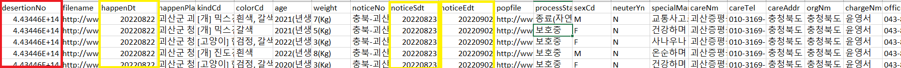
</p>
<p align = "center">
 <em>그림 1: 데이터 수정 전 </em>
</p>
   
   desertionNo Column는 Number포맷으로 바꾼다
   happenDt, noticeSdt 및 noticeEdt는 Datetime (“yyyy-mm-dd”)포맷으로 바꾼다.
   결과
   <p align="center">
 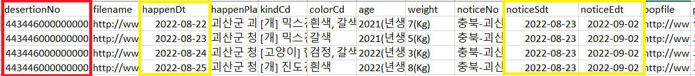
</p>
<p align = "center">
 <em>그림 2: 데이터 수정 결과 </em>
</p>

   ### 5. 키바나 데이터 비주얼라이저를 이용한 파일 거져오고 데이터 Discovery
   키바나에서 제공하는 데이터 비주얼라이저 메뉴를 이용하고 수정된 CSV 파일을 엘라스틱서치에 저장한다. 이 과제에서 파일 저장이름은 ***abandonmet202208-*** * 이다.
   **Dev Tool**를 이용하여 키바나 콘솔에서 매트릭 집계를 통해 데이터 범위를 확인한다. 
   **happenDt** (접수일)는 **2022-08-01부터 2022-08-22까지**의 범위를 갖고 있다.
   
   ```elasticsearch

GET abandonment202208-*/_search
 {
   "size": 0,
   "aggs": {
     "rdate": {
       "stats": {
         "field": "happenDt"
       }
     }
   }
 }
```
 <p align="center">
 
</p>
<p align = "center">
 <em>그림 3: Data Discovery </em>
</p>

   ### 6. 키바나에서 분석
   인덱스 패턴 이름을 ***abandonment202208-*** * 라고 지정하고 타임 필터에서 **timestamp**를 선택한다. 다음 링크를 참고하고 기간은 **2022년 8월 1일 ~ 2022년 8월 22일**을
선정하기를 바란다. 다음 URL를 크릭하여 [Dashboard](http://20.214.241.250:5601/app/dashboards#/view/e0d39e10-22ea-11ed-9c12-83496c1b08fe?_g=(filters:!(),refreshInterval:(pause:!t,value:0),time:(from:'2022-07-31T15:00:00.000Z',to:now))) 보여줄 것이다.

   #### 6.1.	2022년 8월 1일 ~ 2022년 8월 22일 총 접수량 및 날짜별 접수량은 얼마인가? 날짜별 게시된 공고는 얼마인가?
   <p align="center">
 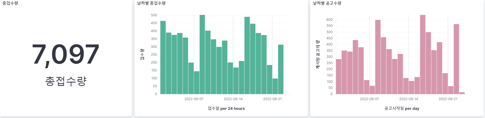
</p>
<p align = "center">
 <em>그림 4: 총 접수량 및 날짜별 접수량 및 게시된 공고 </em>
</p>
 
   #### 6.2.	총품중 및 품종별 접수량이 얼마인가?
   <p align="center">
 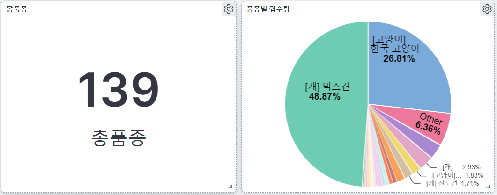
</p>
<p align = "center">
 <em>그림 5: 데이터 수정 결과 </em>
</p>
 
   #### 6.3.	각 품종별 보호상태가 어떻게 되나요?
   
  <p align="center">
 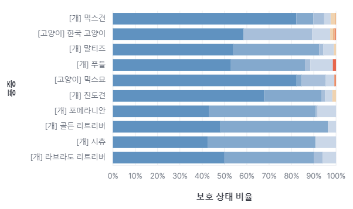
</p>
<p align = "center">
 <em>그림 6: 각 품종별 보호상태 </em>
</p>
 
 #### 6.4.	품종별 성별과 색상은 어떻게 되나요?
 <p align="center">
 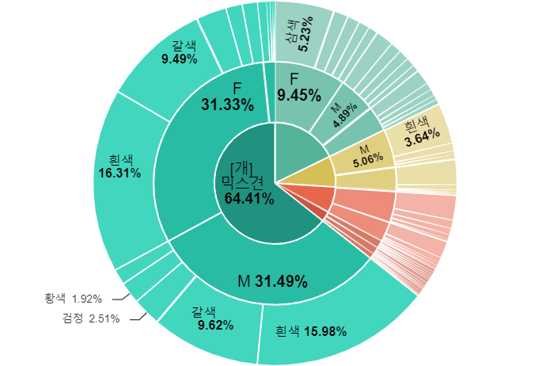
</p>
<p align = "center">
 <em>그림 7: 품종별 성별과 색상 </em>
</p>

   #### 6.5.	나이 비율 및 나이와 체중 관계가 어떻게 되나요?
   <p align="center">
 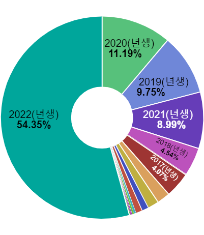
</p>
<p align = "center">
 <em>그림 8: 나이 비율 </em>
</p>

<p align="center">
 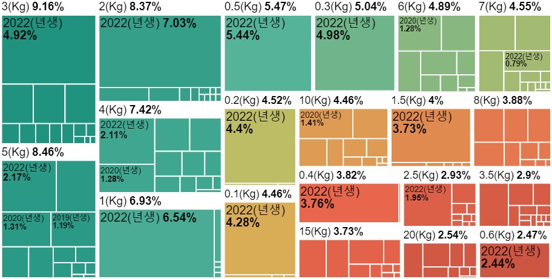
</p>
<p align = "center">
 <em>그림 9: 나이와 체중 관계 </em>
</p>

   #### 6.6.	중성화는 어떻게 되나요?
   <p align="center">
 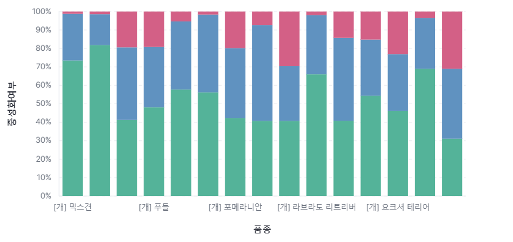
</p>
<p align = "center">
 <em>그림 10: 중성화여부 </em>
</p>
 
   #### 6.7.	 보호소 총 수량 및 보호소별 각 품종 수량은 어떻게 되나요?

 <p align="center">
 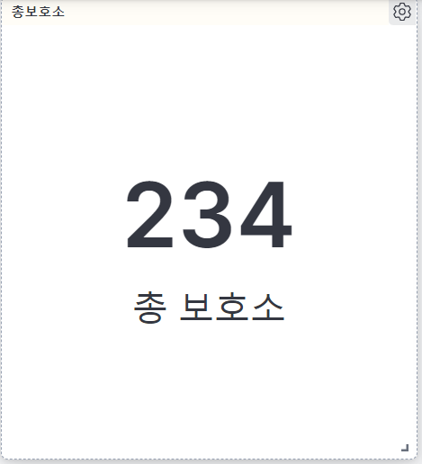
</p>
<p align = "center">
 <em>그림 11: 보호소 총 수량 </em>
</p>
 
 <p align="center">
 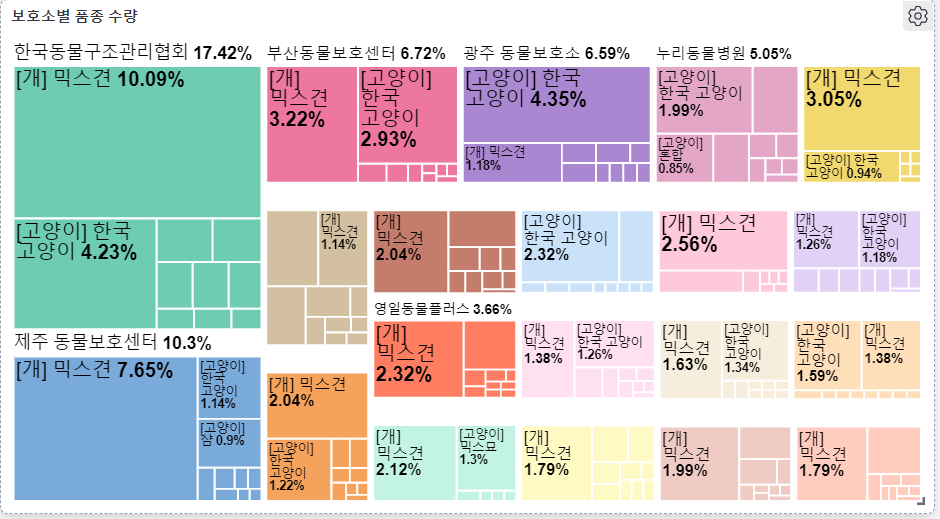
</p>
<p align = "center">
 <em>그림 12: 보호소별 각 품종 수량 </em>
</p>
 
   #### 6.8.	보호소별 보호상태비율 현황은 어떻게 되나요?
 <p align="center">
 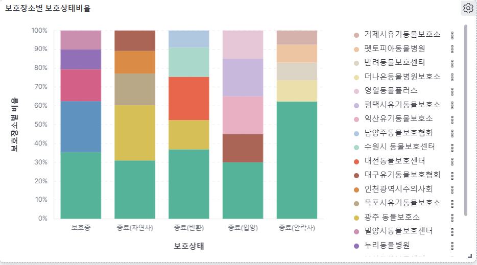
</p>
<p align = "center">
 <em>그림 13: 보호소별 보호상태비율 현황 </em>
</p>

   #### 6.9.	 경기도 보호소 맵
 <p align="center">
 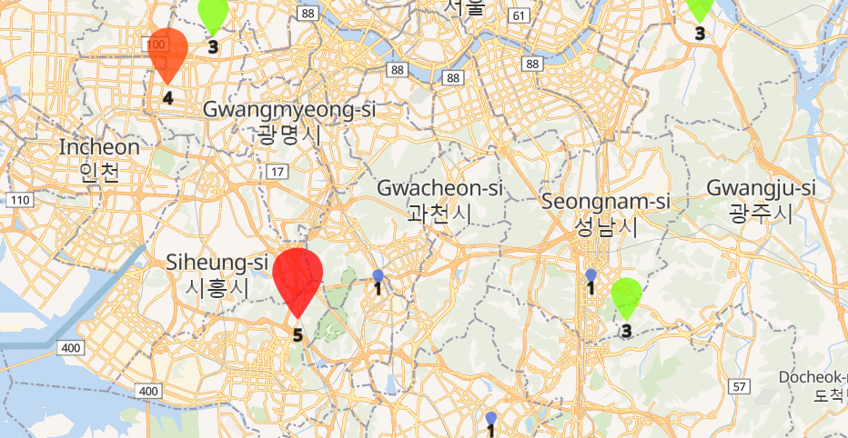
</p>
<p align = "center">
 <em>그림 14: 경기도 보호소 맵 </em>
</p>
